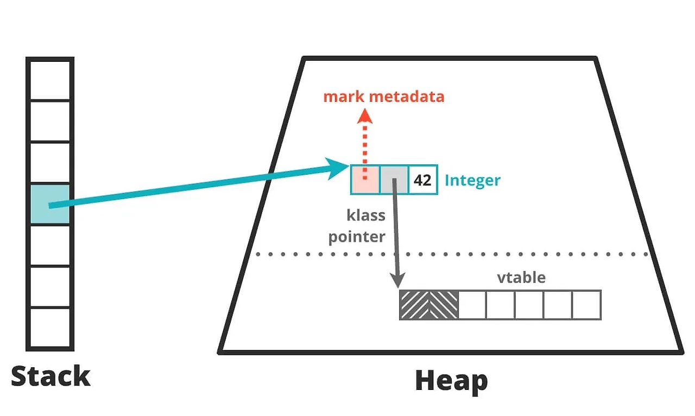

# 4. 가비지 컬렉션 이해하기

자바의 가비지 컬렉션의 핵심은 수명 주기를 런타임이 관리한다는 점입니다.
더 이상 필요하지 않은 객체를 자동으로 제거하며, 이렇게 회수된 메모리를 초기화된 후 재사용할 수 있습니다.

가비지 컬렉션 구현은 다음 구 자기 규칙을 준수합니다.
- 활성 객체는 절대 수집되지 않아야 합니다.
- 알고리즘은 모든 가비지를 수집해야 합니다.

이 중에서도 첫 번째 규칙이 중요합니다.
활성 객체를 수집하려면 세그멘테이션 오류(segmentation fault)가 발생하거나,
프로그램 데이터가 조용히 손상(silent corruption)될 수 있습니다.
가비지 컬렉션 알고리즘이 일부 가비지를 지속적으로 수집하지 못한다면,
최악의 경우 시간이 지나면서 메모리를 모두 소진하여 `OutOfMemoryError`가 발생할 수 있습니다.
이는 심각한 문제지만, 활성 객체를 잘못 수집하여 메모리 손상을 유발하는 것보단는 상대적으로 나은 상황에 속합니다.

> [!TIP]
> 세그멘테이션 오류는 프로그램이 허용되지 않은 메모리 영역에 접근을 시도하거나, 허용되지 않은 방법으로 메모리 영역에 접근을 시도할 경우 발생합니다.
> 운영체제의 메모리 보호 기능이 이를 감지하면 보통 해당 프로세스를 강제 종료합니다.

두 번째 규칙은 다음과 같은 가비지 컬렉션 알고리즘 방식처럼 비교적 유연하게 적용될 수 있습니다. 
- 오래된 객체를 힙에 오랫동안 남겨두고, 전체 가비지 컬렉션 사이클이 실행될 때까지 이를 수집하지 않는 방식
- 특정 메모리 영역에 가비지가 충분히 쌓이지 않았다면 해당 영역을 수집하지 않는 방식

## 마크 앤 스윕
가비지 컬렉션은 마크 앤 스윕 알고리즘을 기반합니다.
마크 앤 스윕 알고리즘은 할당된 객체 리스트를 사용하여,
회수되지 않은 객체들의 포인터를 유지하는 방식으로 동작합니다.
이 과정은 다음과 같이 정리할 수 있습니다.
1. 할당된 리스트를 순회하며 마크 비트(mark bit)를 초기화합니다.
2. 힙으로의 모든 포인터를 시작점으로 하여 접근 가능한 모든 객체를 찾습니다.
3. 도달한 각 객체에 마크 비트를 설정합니다.
4. 할당된 리스트를 순회하며, 마크 비트가 설정되지 않은 객체에 대해 다음 작업을 수행합니다.
  - 힙에서 해당 객체의 메모리를 회수하여 자유 리스트(free list)에 다시 추가합니다.
  - 객체를 할당된 리스트에서 제거합니다.

활성 객체는 보통 깊이 우선 탐색(DFS, Depth First Search)으로 탐색되며,
이렇게 만들어진 객체의 그래프를 활성 그래프(live object graph)라고 합니다.
이는 접근 가능한 객체의 추이적 폐쇄(transitive closure of reachable objects)라고도 부릅니다.
반대로, 접근할 수 없는 객체는 죽은 객체라고 합니다. 

> [!TIP]
> 힙의 상태를 시각화하는 도구 들 중 하나인 `visualvm`을 사용하면, 힙에 할당된 객체의 수와 메모리 사용량을 확인할 수 있습니다.
> 

## 가비지 컬렉션 용어

### STW
STW는 Stop The World의 약자로, 가비지 컬렉션 사이클이 진행되는 동안 모든 애플리케이션 스레드를 멈춰야 합니다.
이를 통해 애플리케이션 코드가 가비지 컬렉션 스레드가 보는 힙 상태를 무효화하지 않도록 보장합니다.
일반적으로 이 방식을 사용합니다.

### 동시성
가비지 컬렉션 스레드가 애플리케이션 스레드가 실행되는 동안에도 동작할 수 있습니다.
이러한 방식은 계산 자원을 더 많이 소모됩니다.
핫스팟의 기본 가비지 컬렉터는 G1(garbage first)이며, G1은 일부 동시성 측면을 가지고 있습니다.

## 병렬
가비지 컬렉션 작업을 여러 스레드와 여러 코어를 사용해 실행합니다.

## 보수성
GC에서 보수성(conservative) 이란, 어떤 값이 포인터인지 확실히 알 수 없을 때도 
“포인터일 가능성이 있다면 포인터로 취급해” 객체를 살아 있다고 판단하는 방식입니다.
이 방식은 실제 사용 중인 객체를 실수로 회수하는 위험은 줄이지만, 단순 정수값 등을 포인터로 오인해 이미 쓰이지 않는 객체를 회수하지 못할 수 있습니다.
즉, 메모리를 잘못 해제하는 것보다 불필요한 메모리를 남기는 쪽을 선택하는 안전 우선의 근사 방식이며, 
그 결과로 메모리 낭비나 단편화가 발생할 수 있습니다.

## 이동
이동형 컬렉터에서는 객체가 메모리 내에서 재배치될 수 있습니다.
즉, 객체가 고정된 주소를 갖지 않음을 의미하고, 
자바와 달리 원시 포인터를 직접 다룰 수 있는 환경에서는 이동형 컬렉터를 적용하기 어렵습니다.

## 압축 
가비지 컬렉션 사이클이 끝날 때, 할당된 메모리(생존 객체)는 단일 연속 영역(보통 해당 영역의 시작 부분)에 배치되고,
새로운 객체를 기록할 수 있는 빈 공간의 시작 지점을 가리키는 포인터가 존재합니다.
압축 컬렉터는 메모리 단편화를 방지합니다.

## 대피
가비지 컬렉션 사이클이 끝날 때, 수집된 영역은 완전히 비워지고, 
모든 활성 객체가 다른 메모리 영역으로 이동(대피)됩니다.
우수한 대피형 컬렉터는 메모리 단편화를 방지합니다.

